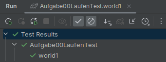

# 🐞 JavaKara TDD

Alle editierbaren Files liegen in `src/test/java/aufgaben/`.

1. Kara benötigt Java als Laufzeitumgebung. Wir installieren Java aus IntelliJ heraus. 
   `☰` | `File` | `Project Structure...` | `Project Settings` `SDK` | Im Dropdown 🞃 `Download JDK...`  | Version: 21 (Vendor ist egal) > `Download`
2. Wir brauchen eine lesbare Aufgabenstellung. Navigiere nach 
    `☰` | `File` | `Settings` | `Editor` | `General` | `Appearance` | ☑ Render documentation comments | `OK`
3. Öffne die erste Aufgabe `java/aufgaben/Aufgabe01KleeblattEssenTest.java` und bearbeite die `myProgram`-Funktion.
4. Teste das Verhalten des Programms via ▶️-Button > `Run ...`. 

5. Die Aufgabe ist geschafft, wenn ein Programm geschrieben wurde, das alle Welten gleichzeitig löst.
  Der Test ist "grün" ✅. 

